##### 一、准备工作

###### 		1.Visual Studio NuGet程序包源配置

​				源地址：http://47.102.150.59:8087/nuget/

​				一些辅助功能包，能提高开发效率


###### 		2.创建项目

​				选择项目类型、自定义项目名称


###### 		 3.基础配置

​				项目应用端口配置、IOC容器配置、日志配置、数据库配置、Map映射配置...

```c#
//Program.cs
		public static void Main(string[] args)
        {
            var config = new ConfigurationBuilder()
                .SetBasePath(Directory.GetCurrentDirectory())
                // 添加端口配置文件
                .AddJsonFile("hosting.json", true)
                .Build();

            var host = Host.CreateDefaultBuilder(args)
                // 添加Autofac作为IOC容器
                .UseServiceProviderFactory(AppServiceProvider.Instance().AutofacServiceProviderFactory)
                .ConfigureWebHostDefaults(webHostBuilder =>
                {
                    webHostBuilder
                      .UseContentRoot(Directory.GetCurrentDirectory())
                      .UseConfiguration(config)
                      .UseStartup<Startup>();
                })
                .Build();

            host.Run();
        }
```

```c#
//Startup.cs
		public void ConfigureServices(IServiceCollection services)
        {
            MapperHelper.CreateMap();//Map映射配置
            services.UseNCoreAspNet<NCoreAspNetOptions>(options =>
            {
                //日志配置
                options.Log4netConfig = "log4net.config";
                options.UseUpload = true;
                options.UseAnyCors = true;
                options.ApiSecurityFilter = false;
                //数据库配置
                options.DefaultDBOptions = new DefaultDBOptions
                {
                    DBSectionName = "DBConnectionSetting",
                    DefaultConnectionName = "defaultConnection"
                };
            });
        }
```


##### 二、API实现

###### 		1.创建数据模型（ViewModel）

​				定义接口需要数据属性（名称、类型、约束等...）【属性命名规则全部用小写，方便前端 JS 调用时不用检查某个属性大小写问题】

```c#
    /// <summary>
    ///用户基本信息
    /// </summary>
    public class UserViewMmodel
    {
        /// <summary>
        /// 用户名
        /// </summary>
        public string user_name { get; set; } = "hanbing";

        /// <summary>
        /// 昵称
        /// </summary>
        public string nickname { get; set; } = "老卢聊技术";

        /// <summary>
        /// qq号码
        /// </summary>
        public string qq { get; set; } = "81868164";

        /// <summary>
        ///微信号码
        /// </summary>
        public string wxid { get; set; } = "hanbing_81868164";

        /// <summary>
        /// 地址
        /// </summary>
        public string address { get; set; }

        /// <summary>
        /// 年龄
        /// </summary>
        public int age { get; set; }

        /// <summary>
        /// 创建时间
        /// </summary>
        public DateTime creation_time { get; set; }

        /// <summary>
        /// 版本信息
        /// </summary>
        public string version { get; set; }
    }
```


###### 		2.创建控制器（Controller），编写逻辑代码

​				1）.设置接口输出数据格式（JSON或XML）

```c#
    [Produces("application/json")]//Controller中方法默认输出json格式数据
	//[Produces("application/xml")]//Controller中方法默认输出xml格式数据
    public class TestApiController : Controller
```

​				2）.设置接口路由（定义接口版本【方便后期和新版本区分】）

```c#
    [Route("api/v1/testapi")]//固定路由配置
	//[Route("api/v1/[controller]")]//固定部分路由配置
    public class TestApiController  : Controller
```

​				3）.设置接口请求Method，常见如下：

​							GET ：从服务器取出资源（一项或多项）

​							POST ：在服务器新建一个资源

​							PUT ：在服务器更新资源（客户端提供改变后的完整资源）

​							PATCH ：在服务器更新资源（客户端提供改变的属性）

​							DELETE ：从服务器删除资源

```c#
        /// <summary>
        /// 返回用户信息接口
        /// </summary>
        /// <returns></returns>
        [HttpGet]//请求方法为GET
        [Route("getuser")]//自定义路由
        //[Produces("application/xml")]//输出xml格式
        public Task<UserViewMmodel> Index()
        {}
```

​				4）.返回JSON数据格式接口

```c#
        /// <summary>
        /// 返回用户信息接口
        /// </summary>
        /// <returns></returns>
        [HttpGet]//请求方法为GET
        [Route("getuser")]//自定义路由
        //[Produces("application/xml")]//输出xml格式
        public Task<ViewModelBase<UserViewMmodel>> Index()
        {
            return Task.Run(() =>
            {
                ViewModelBase<UserViewMmodel> res = new ViewModelBase<UserViewMmodel>();
                //业务逻辑代码....
                res = new ViewModelBase<UserViewMmodel>
                {
                    code = 0,
                    msg = "成功返回用户信息",
                    data = new UserViewMmodel
                    {
                        address = "上海市浦东区世纪大道200号",
                        age = 23,
                        creation_time = DateTime.Now,
                        version = "v1.0"
                    }
                };

                return res;
            });
        }
```

​				5）.返回文件（输出文件）接口

```c#
        /// <summary>
        /// 输出文件接口
        /// </summary>
        /// <returns></returns>
        [HttpGet]//请求方法为GET
        [Route("getfile")]//自定义路由
        public FileResult Download()
        {
            var fileData = $"{Directory.GetCurrentDirectory()}/wwwroot/css/site.css";
            var actionresult = new FileStreamResult(fileData.GetFileData().ToStream(), "text/css");
            actionresult.FileDownloadName = "site.css";
            return actionresult;
        }
```

​				6）.裁剪图片接口

```c#
        /// <summary>
        /// 裁剪图片接口
        /// </summary>
        /// <param name="width"></param>
        /// <param name="name"></param>
        /// <returns></returns>
        [HttpGet]//请求方法为GET
        [Route("getimage/{width}/{name}")]//自定义路由
        public IActionResult GetImage(int width, string name)
        {
            var imgPath = $@"{Directory.GetCurrentDirectory()}/wwwroot/imgs/{name}";

            //缩小图片
            using (var imgBmp = new Bitmap(imgPath))
            {
                //找到新尺寸
                var oWidth = imgBmp.Width;
                var oHeight = imgBmp.Height;
                var height = oHeight;
                if (width > oWidth)
                {
                    width = oWidth;
                }
                else
                {
                    height = width * oHeight / oWidth;
                }
                var newImg = new Bitmap(imgBmp, width, height);
                newImg.SetResolution(72, 72);
                byte[] bytes;
                using (var ms = new MemoryStream())
                {
                    newImg.Save(ms, ImageFormat.Bmp);
                    bytes = ms.GetBuffer();
                }
                return new FileContentResult(bytes, "image/jpeg");
            }
        }
```

​				7）.上传单个文件接口

```c#
        /// <summary>
        /// 上传文件,需要指定name值为fromFile，如：form-data; name="fromFile"; filename="8.png"
        /// </summary>
        /// <param name="fromFile"></param>
        /// <returns></returns>
        [Route("upfile")]//自定义路由
        [HttpPost]//请求方法为POST
        [AllowAnonymous]
        public Task<UpFileViewModel> UplodeFile([FromForm] IFormFile fromFile)
        {
            return Task.Run(() =>
            {
                UpFileViewModel res = new UpFileViewModel();
                if (fromFile != null)
                {
                    using (var sm = fromFile.OpenReadStream())
                    {
                        string filePath = $"upfiles/{Id.LongId()}{fromFile.FileName.GetExtension()}";

                        string savePath = $"{Directory.GetCurrentDirectory()}/wwwroot/{filePath}";
                        sm.Save(savePath);
                        res = new UpFileViewModel
                        {
                            code = 0,
                            msg = "保存成功",
                            data = filePath
                        };
                    }
                }
                return res;
            });
        }
```

​				8）.上传多个文件接口

```c#
        /// <summary>
        /// 上传多个文件,需要指定name值为files，如：form-data; name="files"; filename="8.png"
        /// </summary>
        /// <param name="fromFile"></param>
        /// <returns></returns>
        [Route("upfiles")]//自定义路由
        [HttpPost]//请求方法为POST
        [AllowAnonymous]
        public Task<ViewModelBase<List<string>>> UplodeFiles([FromForm] IFormFileCollection files)
        {
            return Task.Run(() =>
            {
                ViewModelBase<List<string>> res = new ViewModelBase<List<string>>();
                if (files != null)
                {
                    res.data = new List<string>();
                    files.ForEach(fromFile =>
                    {
                        using (var sm = fromFile.OpenReadStream())
                        {
                            string filePath = $"upfiles/{Id.LongId()}{fromFile.FileName.GetExtension()}";
                            string savePath = $"{Directory.GetCurrentDirectory()}/wwwroot/{filePath}";
                            sm.Save(savePath);

                            res.data.Add(filePath);
                        }
                    });
                }
                return res;
            });
        }
```

​				9）.上传多文件接口，上传时不需要指定name参数

```c#
        /// <summary>
        /// 上传时不需要指定name参数:form-data; name=""; filename="222222222222.jpg"
        /// </summary>
        /// <returns></returns>
        [Route("upfiles2")]//自定义路由
        [HttpPost]//请求方法为POST
        [AllowAnonymous]
        public Task<ViewModelBase<List<string>>> UplodeFiles2()
        {
            return Task.Run(() =>
            {
                ViewModelBase<List<string>> res = new ViewModelBase<List<string>>();

                var files = this.Request.Form?.Files;
                if (files != null)
                {
                    res.data = new List<string>();
                    files.ForEach(fromFile =>
                    {
                        using (var sm = fromFile.OpenReadStream())
                        {
                            string filePath = $"upfiles/{Id.LongId()}{fromFile.FileName.GetExtension()}";
                            string savePath = $"{Directory.GetCurrentDirectory()}/wwwroot/{filePath}";
                            sm.Save(savePath);

                            res.data.Add(filePath);
                        }
                    });
                }
                return res;
            });
        }
```

###### 		3.进行接口调用测试（Postman工具）

​			1）.启动VS调试功能

```json
//hosting.json
//系统运行端口配置
{
  "urls": "http://*:97"
}
```

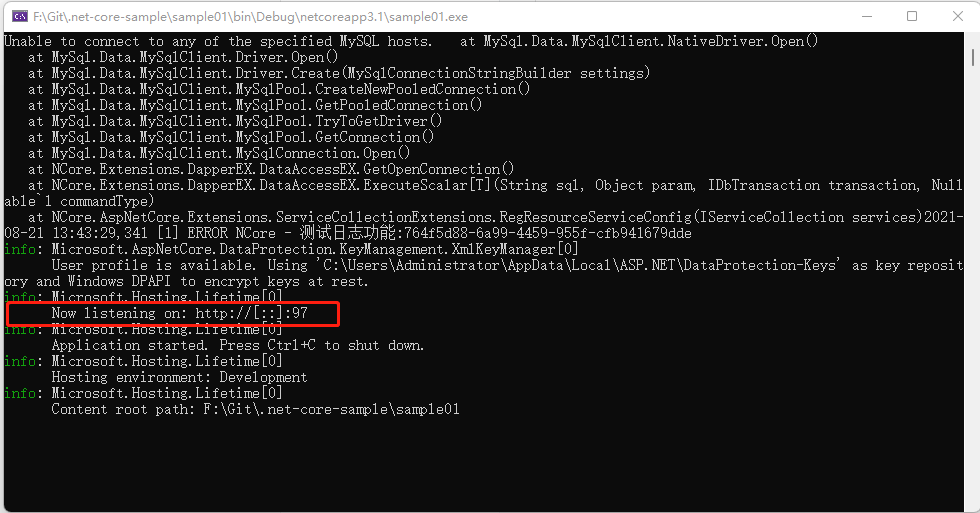

​			使用Postman进行用户信息接口测试

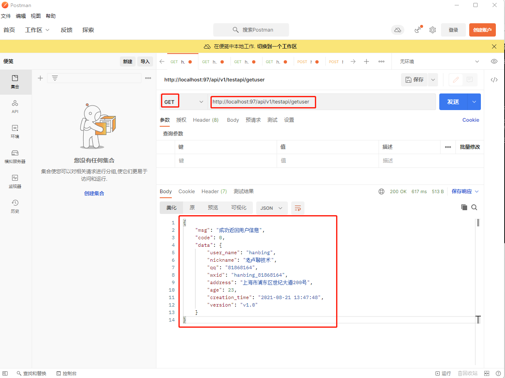

​		进行返回文件接口测试

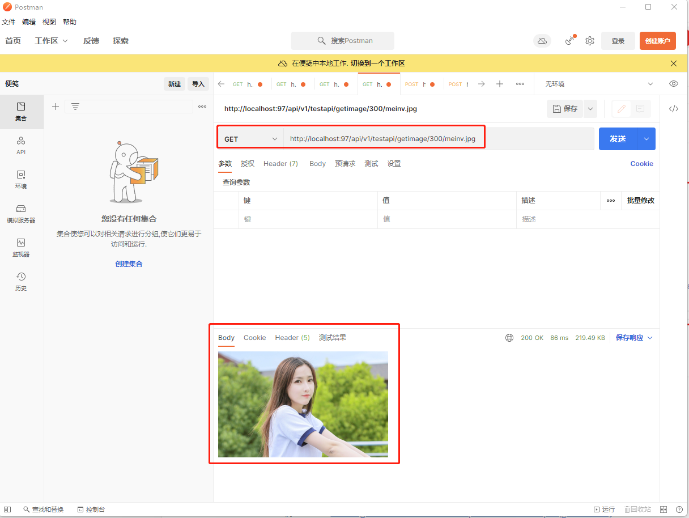

​			上传文件接口进行测试

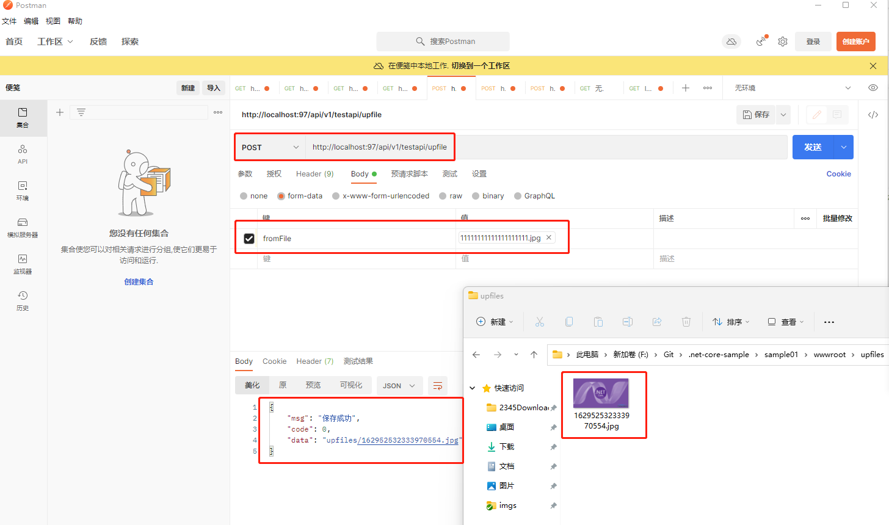

###### 		4.增加日志记录功能

​				1）.添加日志依赖注入必性：

```c#
    public class TestApiController : Controller
    {

        #region 日志相关
        public NCore.Logging.ILoggerFactory loggerFactory { get; set; }

        private NCore.Logging.ILogger _logger;

        /// <summary>
        /// 日志对象
        /// </summary>
        public NCore.Logging.ILogger Logger
        {
            get
            {
                if (_logger == null)
                    _logger = loggerFactory.GetCurrentClassLogger(typeof(TestApiController));
                return _logger;
            }
        }
        #endregion
```

​				2）.记录运行、异常日志：

```c#
                try
                {
                    //业务逻辑代码....
                    res = new ViewModelBase<UserViewMmodel>
                    {
                        code = 0,
                        msg = "成功返回用户信息",
                        data = new UserViewMmodel
                        {
                            address = "上海市浦东区世纪大道200号",
                            age = 23,
                            creation_time = DateTime.Now,
                            version = "v1.0"
                        }
                    };
                }
                catch (Exception ex)
                {
                    Logger.Error($"唉，出错了：{ex.Message}\n{ex.StackTrace}");
                }
```

​					文件不存在日志记录：

```
        public IActionResult GetImage(int width, string name)
        {
            var imgPath = $@"{Directory.GetCurrentDirectory()}/wwwroot/imgs/{name}";
            if (imgPath.ExistsFile())
            {
            	//....
            }
            else
            {
                Logger.Warn($"文件不存在：{imgPath}");
                return Content("文件不存在");
            }
        }
```

​				日志信息：

```tex
2021-08-21 13:43:29,341 [1] ERROR NCore [(null)] - 测试日志功能:764f5d88-6a99-4459-955f-cfb941679dde
2021-08-21 14:01:59,570 [117] WARN  sample01.Controllers.v1.TestApiController [(null)] - 文件不存在：F:\Git\.net-core-sample\sample01/wwwroot/imgs/meinv2.jpg
```

​			日志模块默认采用的是log4net，可以在log4net.config文件进行环境里日志需求配置，如：

```xml
<?xml version="1.0" encoding="utf-8" ?>
<configuration>
  <!-- This section contains the log4net configuration settings -->
  <log4net>
    <appender name="ConsoleAppender" type="log4net.Appender.ConsoleAppender">
      <layout type="log4net.Layout.PatternLayout" value="%date [%thread] %-5level %logger - %message%newline" />
    </appender>

    <appender name="FileAppender" type="log4net.Appender.FileAppender">
      <file value="log-file.log" />
      <appendToFile value="true" />
      <layout type="log4net.Layout.PatternLayout">
        <conversionPattern value="%date [%thread] %-5level %logger [%property{NDC}] - %message%newline" />
      </layout>
    </appender>

    <appender name="RollingLogFileAppender" type="log4net.Appender.RollingFileAppender">
      <file value="logs/" />
      <appendToFile value="true" />
      <rollingStyle value="Composite" />
      <staticLogFileName value="false" />
      <datePattern value="yyyyMMdd'.log'" />
      <maxSizeRollBackups value="10" />
      <maximumFileSize value="1MB" />
      <layout type="log4net.Layout.PatternLayout">
        <conversionPattern value="%date [%thread] %-5level %logger [%property{NDC}] - %message%newline" />
      </layout>
    </appender>

    <appender name="AopRollingLogFileAppender" type="log4net.Appender.RollingFileAppender">
      <file value="logs/" />
      <appendToFile value="true" />
      <rollingStyle value="Composite" />
      <staticLogFileName value="false" />
      <datePattern value="yyyyMMdd'_Aop.log'" />
      <maxSizeRollBackups value="10" />
      <maximumFileSize value="1MB" />
      <layout type="log4net.Layout.PatternLayout">
        <conversionPattern value="%date [%thread] %-5level %logger [%property{NDC}] - %message%newline" />
      </layout>
    </appender>

    <root>
      <level value="ALL" />
      <appender-ref ref="ConsoleAppender" />
      <!--<appender-ref ref="FileAppender" />-->
      <appender-ref ref="RollingLogFileAppender" />
    </root>
    <logger name="Aop">
      <level value="ALL"/>
      <appender-ref ref="AopRollingLogFileAppender" />
    </logger>

  </log4net>
</configuration>
```


#### 		5.发布接口程序到服务器（ windows & centos & docker ）

##### 			1.发布项目文件

###### 						1）.在解决方案中项目上右键选择“发布”

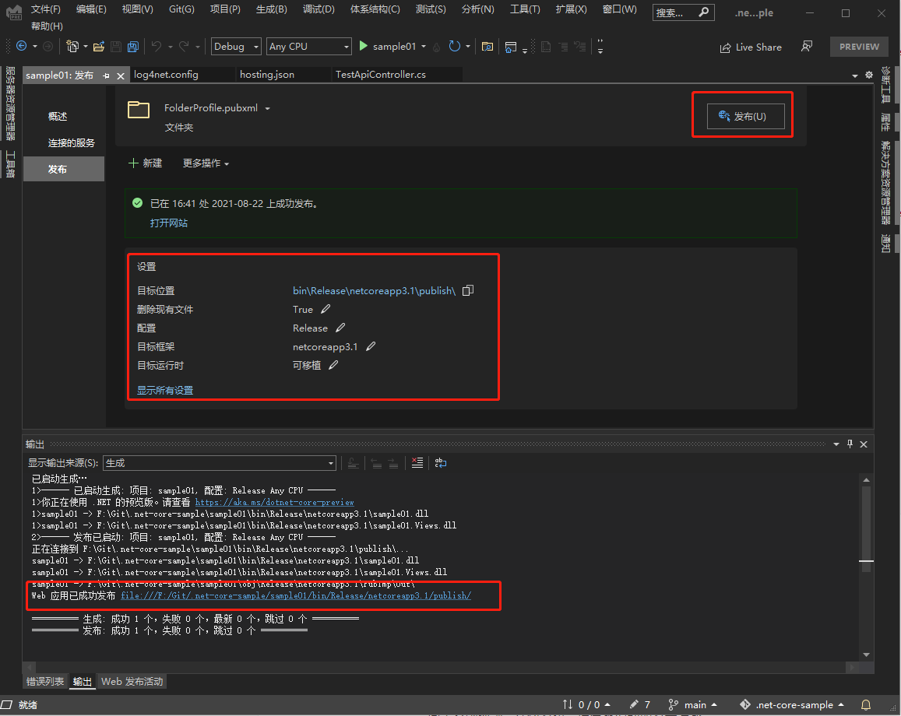

###### 					2）.在windows（我使用的是win11;win10和win7安装方法一样）下IIS中安装.net core运行环境

​							a）.下载 .net core hosting [Download .NET Core 3.1 (Linux, macOS, and Windows) (microsoft.com)](https://dotnet.microsoft.com/download/dotnet/3.1)

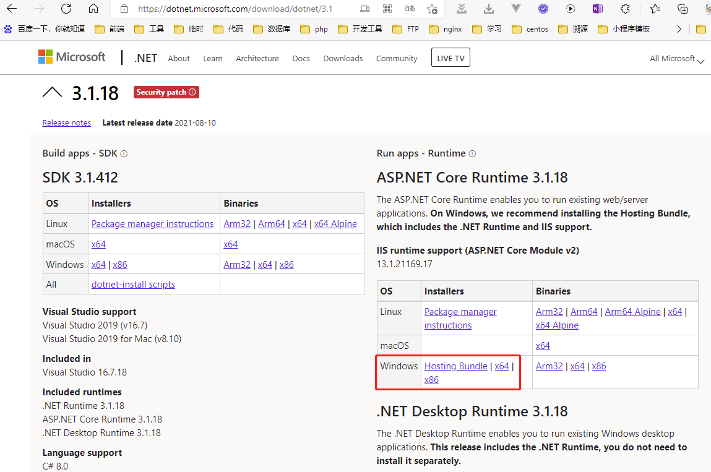

​				b）.IIS创建应用程序池

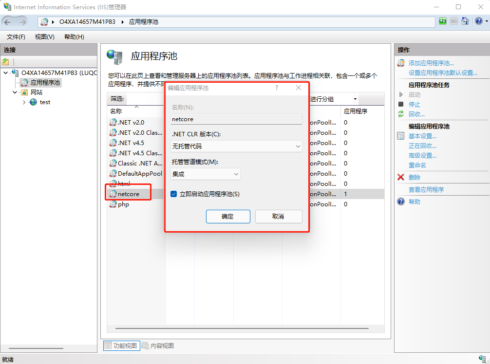

​					c）.IIS创建站点（自定义网站名称，选择刚才创建的程序池，设置网站内容的物理路径【就是上面项目发布后的文件】，绑定网站是HTTP还是HTTPS类型，网站端口配置，如果是发布到服务器上通常是通过域名来访问，所以下面的主机名就是你解析到服务器的域名【访问前记得解析域名哟】）

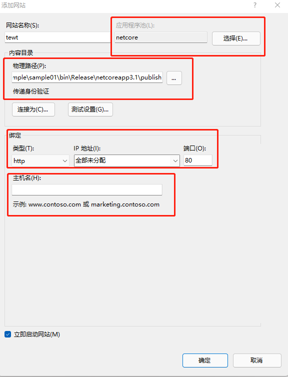

​					d）.测试站点是否能正常运行（在浏览器里访问一个我们之前编写好的接口）

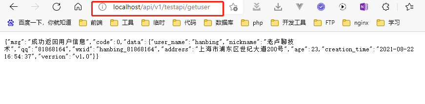

​					到这里IIS部署.net core项目已经完成了，是不是很简单，下面我们就要开始在CentOS里部署.net core

###### 					3）.在CentOS（我使用的是centos7.5版本）上安装.net core运行环境

​								a），安装packages-microsoft-prod.rpm

```shell
sudo rpm -Uvh https://packages.microsoft.com/config/rhel/7/packages-microsoft-prod.rpm
```

需要先安装微软在Linux下的软件包，执行以上命令即可；

​								b），更新yum

```shell
sudo yum update
```

更新软件包，执行以上命令即可；

​								c），安装.Net Core （本文安装的是.Net Core 3.1）

```shell
sudo yum install dotnet-sdk-3.1
```

至此，.Net Core在Linux下安装成功，如下图所示：

```shell
dotnet --version
```

整个过程输出如下：

```shell
[root@VM-0-2-centos ~]# sudo rpm -Uvh https://packages.microsoft.com/config/rhel/7/packages-microsoft-prod.rpm
Retrieving https://packages.microsoft.com/config/rhel/7/packages-microsoft-prod.rpm
Preparing...                          ################################# [100%]
	package packages-microsoft-prod-1.0-1.el7.noarch is already installed
[root@VM-0-2-centos ~]# sudo yum update
Loaded plugins: fastestmirror, langpacks
Loading mirror speeds from cached hostfile
No packages marked for update
[root@VM-0-2-centos ~]# sudo yum install dotnet-sdk-3.1
Loaded plugins: fastestmirror, langpacks
Loading mirror speeds from cached hostfile
Resolving Dependencies
--> Running transaction check
---> Package dotnet-sdk-3.1.x86_64 0:3.1.412-1 will be installed
--> Processing Dependency: dotnet-runtime-3.1 for package: dotnet-sdk-3.1-3.1.412-1.x86_64
--> Processing Dependency: aspnetcore-runtime-3.1 for package: dotnet-sdk-3.1-3.1.412-1.x86_64
--> Running transaction check
---> Package aspnetcore-runtime-3.1.x86_64 0:3.1.18-1 will be installed
---> Package dotnet-runtime-3.1.x86_64 0:3.1.18-1 will be installed
--> Processing Dependency: dotnet-runtime-deps-3.1 >= 3.1.18 for package: dotnet-runtime-3.1-3.1.18-1.x86_64
--> Running transaction check
---> Package dotnet-runtime-deps-3.1.x86_64 0:3.1.18-1 will be installed
--> Processing Dependency: libicu for package: dotnet-runtime-deps-3.1-3.1.18-1.x86_64
--> Running transaction check
---> Package libicu.x86_64 0:50.2-4.el7_7 will be installed
--> Finished Dependency Resolution

Dependencies Resolved

===========================================================================================================
 Package                        Arch          Version             Repository                          Size
===========================================================================================================
Installing:
 dotnet-sdk-3.1                 x86_64        3.1.412-1           packages-microsoft-com-prod         71 M
Installing for dependencies:
 aspnetcore-runtime-3.1         x86_64        3.1.18-1            packages-microsoft-com-prod        7.5 M
 dotnet-runtime-3.1             x86_64        3.1.18-1            packages-microsoft-com-prod         29 M
 dotnet-runtime-deps-3.1        x86_64        3.1.18-1            packages-microsoft-com-prod        2.8 k
 libicu                         x86_64        50.2-4.el7_7        os                                 6.9 M

Transaction Summary
===========================================================================================================
Install  1 Package (+4 Dependent packages)

Total download size: 114 M
Installed size: 298 M
Is this ok [y/d/N]: y
Downloading packages:
(1/5): aspnetcore-runtime-3.1.18-x64.rpm                                            | 7.5 MB  00:00:00     
(2/5): dotnet-runtime-deps-3.1.18-rhel.7-x64.rpm                                    | 2.8 kB  00:00:00     
(3/5): libicu-50.2-4.el7_7.x86_64.rpm                                               | 6.9 MB  00:00:00     
(4/5): dotnet-sdk-3.1.412-x64.rpm                                                   |  71 MB  00:00:08     
(5/5): dotnet-runtime-3.1.18-x64.rpm                                                |  29 MB  00:00:39     
-----------------------------------------------------------------------------------------------------------
Total                                                                      2.9 MB/s | 114 MB  00:00:39     
Running transaction check
Running transaction test
Transaction test succeeded
Running transaction
  Installing : libicu-50.2-4.el7_7.x86_64                                                              1/5 
  Installing : dotnet-runtime-deps-3.1-3.1.18-1.x86_64                                                 2/5 
  Installing : dotnet-runtime-3.1-3.1.18-1.x86_64                                                      3/5 
  Installing : aspnetcore-runtime-3.1-3.1.18-1.x86_64                                                  4/5 
  Installing : dotnet-sdk-3.1-3.1.412-1.x86_64                                                         5/5 
This software may collect information about you and your use of the software, and send that to Microsoft.
Please visit http://aka.ms/dotnet-cli-eula for more information.
Welcome to .NET Core!
---------------------
Learn more about .NET Core: https://aka.ms/dotnet-docs
Use 'dotnet --help' to see available commands or visit: https://aka.ms/dotnet-cli-docs

Telemetry
---------
The .NET Core tools collect usage data in order to help us improve your experience. It is collected by Microsoft and shared with the community. You can opt-out of telemetry by setting the DOTNET_CLI_TELEMETRY_OPTOUT environment variable to '1' or 'true' using your favorite shell.

Read more about .NET Core CLI Tools telemetry: https://aka.ms/dotnet-cli-telemetry

Configuring...
--------------
A command is running to populate your local package cache to improve restore speed and enable offline access. This command takes up to one minute to complete and only runs once.
  Verifying  : dotnet-sdk-3.1-3.1.412-1.x86_64                                                         1/5 
  Verifying  : dotnet-runtime-3.1-3.1.18-1.x86_64                                                      2/5 
  Verifying  : aspnetcore-runtime-3.1-3.1.18-1.x86_64                                                  3/5 
  Verifying  : dotnet-runtime-deps-3.1-3.1.18-1.x86_64                                                 4/5 
  Verifying  : libicu-50.2-4.el7_7.x86_64                                                              5/5 

Installed:
  dotnet-sdk-3.1.x86_64 0:3.1.412-1                                                                        

Dependency Installed:
  aspnetcore-runtime-3.1.x86_64 0:3.1.18-1               dotnet-runtime-3.1.x86_64 0:3.1.18-1             
  dotnet-runtime-deps-3.1.x86_64 0:3.1.18-1              libicu.x86_64 0:50.2-4.el7_7                     

Complete!
[root@VM-0-2-centos ~]# dotnet --version
3.1.412

```

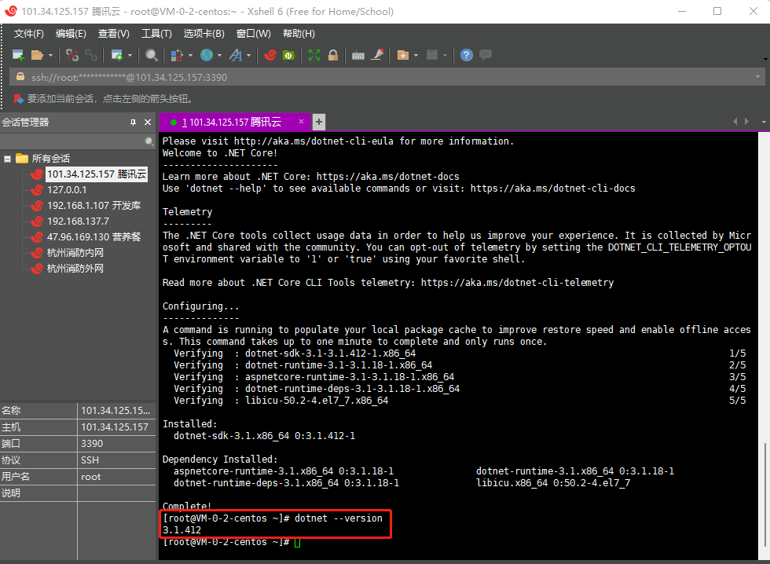

###### 4）.上传发布后的版本到服务器

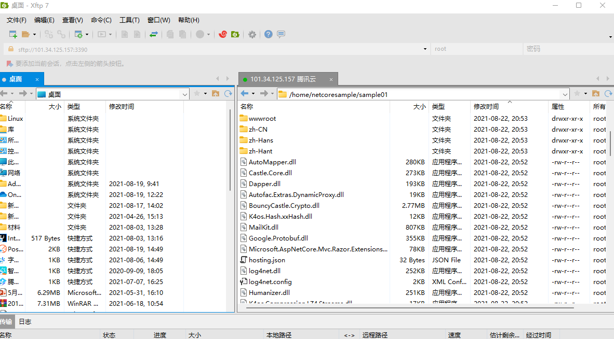

4）.运行.net core程序，进入sample01目录后执行以下命令

```shell
[root@VM-0-2-centos sample01]# dotnet sample01.dll
```
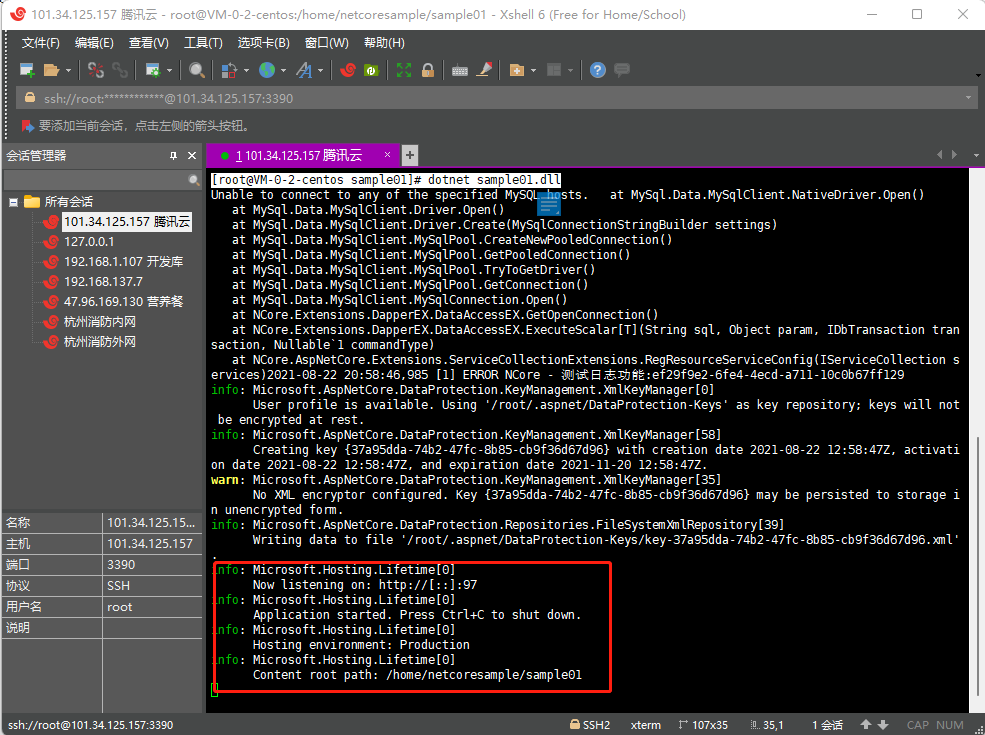

###### 5）.验证服务是否能够访问

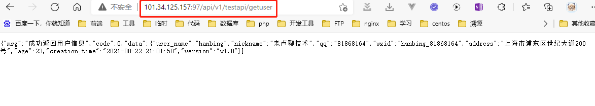

说明我们发布的.net core web api服务已经在centos 7.5上运行起来了

下一篇我们再把.net core web api服务部署到docker容器上


源码地址：[hanbing81868164/.net-core-sample: .net core sample (github.com)](https://github.com/hanbing81868164/.net-core-sample)

同步系统视频会尽快发布，请有需要的朋友关注我


