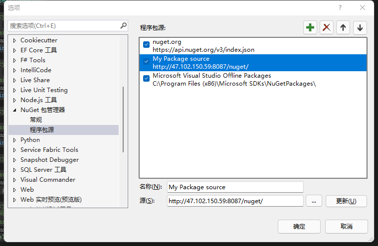
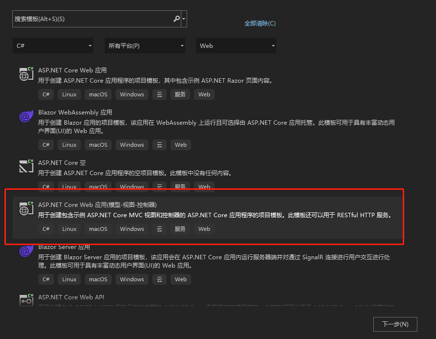

##### 一、准备工作

###### 		1.Visual Studio NuGet程序包源配置

​				源地址：http://47.102.150.59:8087/nuget/

​				一些辅助功能包，能提高开发效率



###### 		2.创建项目

​				选择项目类型、自定义项目名称



###### 		 3.基础配置

​				项目应用端口配置、IOC容器配置、日志配置、数据库配置、Map映射配置...

```c#
//Program.cs
		public static void Main(string[] args)
        {
            var config = new ConfigurationBuilder()
                .SetBasePath(Directory.GetCurrentDirectory())
                // 添加端口配置文件
                .AddJsonFile("hosting.json", true)
                .Build();

            var host = Host.CreateDefaultBuilder(args)
                // 添加Autofac作为IOC容器
                .UseServiceProviderFactory(AppServiceProvider.Instance().AutofacServiceProviderFactory)
                .ConfigureWebHostDefaults(webHostBuilder =>
                {
                    webHostBuilder
                      .UseContentRoot(Directory.GetCurrentDirectory())
                      .UseConfiguration(config)
                      .UseStartup<Startup>();
                })
                .Build();

            host.Run();
        }
```

```c#
//Startup.cs
		public void ConfigureServices(IServiceCollection services)
        {
            MapperHelper.CreateMap();//Map映射配置
            services.UseNCoreAspNet<NCoreAspNetOptions>(options =>
            {
                //日志配置
                options.Log4netConfig = "log4net.config";
                options.UseUpload = true;
                options.UseAnyCors = true;
                options.ApiSecurityFilter = false;
                //数据库配置
                options.DefaultDBOptions = new DefaultDBOptions
                {
                    DBSectionName = "DBConnectionSetting",
                    DefaultConnectionName = "defaultConnection"
                };
            });
        }
```


##### 二、API实现

###### 		1.创建数据模型（ViewModel）

​				定义接口需要数据属性（名称、类型、约束等...）【属性命名规则全部用小写，方便前端 JS 调用时不用检查某个属性大小写问题】

```c#
    /// <summary>
    ///用户基本信息
    /// </summary>
    public class UserViewMmodel
    {
        /// <summary>
        /// 用户名
        /// </summary>
        public string user_name { get; set; } = "hanbing";

        /// <summary>
        /// 昵称
        /// </summary>
        public string nickname { get; set; } = "老卢聊技术";

        /// <summary>
        /// qq号码
        /// </summary>
        public string qq { get; set; } = "81868164";

        /// <summary>
        ///微信号码
        /// </summary>
        public string wxid { get; set; } = "hanbing_81868164";

        /// <summary>
        /// 地址
        /// </summary>
        public string address { get; set; }

        /// <summary>
        /// 年龄
        /// </summary>
        public int age { get; set; }

        /// <summary>
        /// 创建时间
        /// </summary>
        public DateTime creation_time { get; set; }

        /// <summary>
        /// 版本信息
        /// </summary>
        public string version { get; set; }
    }
```


###### 		2.创建控制器（Controller），编写逻辑代码

​				1）.设置接口输出数据格式（JSON或XML）

```c#
    [Produces("application/json")]//Controller中方法默认输出json格式数据
	//[Produces("application/xml")]//Controller中方法默认输出xml格式数据
    public class TestApiController : Controller
```

​				2）.设置接口路由（定义接口版本【方便后期和新版本区分】）

```c#
    [Route("api/v1/testapi")]//固定路由配置
	//[Route("api/v1/[controller]")]//固定部分路由配置
    public class TestApiController  : Controller
```

​				3）.设置接口请求Method，常见如下：

​							GET ：从服务器取出资源（一项或多项）

​							POST ：在服务器新建一个资源

​							PUT ：在服务器更新资源（客户端提供改变后的完整资源）

​							PATCH ：在服务器更新资源（客户端提供改变的属性）

​							DELETE ：从服务器删除资源

```c#
        /// <summary>
        /// 返回用户信息接口
        /// </summary>
        /// <returns></returns>
        [HttpGet]//请求方法为GET
        [Route("getuser")]//自定义路由
        //[Produces("application/xml")]//输出xml格式
        public Task<UserViewMmodel> Index()
        {}
```

​				4）.返回JSON数据格式接口

```c#
        /// <summary>
        /// 返回用户信息接口
        /// </summary>
        /// <returns></returns>
        [HttpGet]//请求方法为GET
        [Route("getuser")]//自定义路由
        //[Produces("application/xml")]//输出xml格式
        public Task<UserViewMmodel> Index()
        {
            return Task.Run(() =>
            {
                UserViewMmodel res = null;
                //业务逻辑代码....
                res = new UserViewMmodel
                {
                    address = "上海市浦东区世纪大道200号",
                    age = 23,
                    creation_time = DateTime.Now,
                    version = "v1.0"
                };

                return res;
            });
        }
```

​				5）.返回文件（输出文件）接口

```c#
        /// <summary>
        /// 输出文件接口
        /// </summary>
        /// <returns></returns>
        [HttpGet]//请求方法为GET
        [Route("getfile")]//自定义路由
        public FileResult Download()
        {
            var fileData = $"{Directory.GetCurrentDirectory()}/wwwroot/css/site.css";
            var actionresult = new FileStreamResult(fileData.GetFileData().ToStream(), "text/css");
            actionresult.FileDownloadName = "site.css";
            return actionresult;
        }
```

​				6）.裁剪图片接口

```c#
        /// <summary>
        /// 裁剪图片接口
        /// </summary>
        /// <param name="width"></param>
        /// <param name="name"></param>
        /// <returns></returns>
        [HttpGet]//请求方法为GET
        [Route("getimage/{width}/{name}")]//自定义路由
        public IActionResult GetImage(int width, string name)
        {
            var imgPath = $@"{Directory.GetCurrentDirectory()}/wwwroot/imgs/{name}";

            //缩小图片
            using (var imgBmp = new Bitmap(imgPath))
            {
                //找到新尺寸
                var oWidth = imgBmp.Width;
                var oHeight = imgBmp.Height;
                var height = oHeight;
                if (width > oWidth)
                {
                    width = oWidth;
                }
                else
                {
                    height = width * oHeight / oWidth;
                }
                var newImg = new Bitmap(imgBmp, width, height);
                newImg.SetResolution(72, 72);
                byte[] bytes;
                using (var ms = new MemoryStream())
                {
                    newImg.Save(ms, ImageFormat.Bmp);
                    bytes = ms.GetBuffer();
                }
                return new FileContentResult(bytes, "image/jpeg");
            }
        }
```

​				7）.上传单个文件接口

```c#
        /// <summary>
        /// 上传文件,需要指定name值为fromFile，如：form-data; name="fromFile"; filename="8.png"
        /// </summary>
        /// <param name="fromFile"></param>
        /// <returns></returns>
        [Route("upfile")]//自定义路由
        [HttpPost]//请求方法为POST
        [AllowAnonymous]
        public UpFileViewModel UplodeFile([FromForm] IFormFile fromFile)
        {
            if (fromFile != null)
            {
                using (var sm = fromFile.OpenReadStream())
                {
                    string savePath = $"{Directory.GetCurrentDirectory()}/wwwroot/temp/{Id.LongId()}{fromFile.FileName.GetExtension()}";
                    sm.Save(savePath);
                }
                return new UpFileViewModel { code = 0, msg = "保存成功" };
            }
            return new UpFileViewModel { code = 1, msg = "保存失败" };
        }
```

​				8）.上传多个文件接口

```c#
        /// <summary>
        /// 上传多个文件,需要指定name值为files，如：form-data; name="files"; filename="8.png"
        /// </summary>
        /// <param name="fromFile"></param>
        /// <returns></returns>
        [Route("upfiles")]//自定义路由
        [HttpPost]//请求方法为POST
        [AllowAnonymous]
        public UpFileViewModel UplodeFiles([FromForm] IFormFileCollection files)
        {
            if (files != null)
            {
                files.ForEach(fromFile =>
                {
                    using (var sm = fromFile.OpenReadStream())
                    {
                        string savePath = $"{Directory.GetCurrentDirectory()}/wwwroot/temp/{Id.LongId()}{fromFile.FileName.GetExtension()}";
                        sm.Save(savePath);
                    }
                });
                return new UpFileViewModel { code = 0, msg = "保存成功" };
            }
            return new UpFileViewModel { code = 1, msg = "保存失败" };
        }
```

​				9）.上传多文件接口，上传时不需要指定name参数

```c#
        /// <summary>
        /// 上传时不需要指定name参数:form-data; name=""; filename="222222222222.jpg"
        /// </summary>
        /// <returns></returns>
        [Route("upfiles2")]//自定义路由
        [HttpPost]//请求方法为POST
        [AllowAnonymous]
        public UpFileViewModel UplodeFiles2()
        {
            var files = this.Request.Form?.Files;
            if (files != null)
            {
                files.ForEach(fromFile =>
                {
                    using (var sm = fromFile.OpenReadStream())
                    {
                        string savePath = $"{Directory.GetCurrentDirectory()}/wwwroot/temp/{Id.LongId()}{fromFile.FileName.GetExtension()}";
                        sm.Save(savePath);
                    }
                });
                return new UpFileViewModel { code = 0, msg = "保存成功" };
            }
            return new UpFileViewModel { code = 1, msg = "保存失败" };
        }
```

​				4）.待续...

###### 		3.进行接口调用测试

###### 		4.增加日志记录功能

###### 		5.发布接口程序到服务器（windows & linux）

源码地址：[hanbing81868164/.net-core-sample: .net core sample (github.com)](https://github.com/hanbing81868164/.net-core-sample)

同步系统视频会尽快发布，请有需要的朋友关注我


